# 🎓 Academix - Next-Gen Student Management Platform

**Revolutionizing Educational Institution Management with Intelligent Analytics**

---

## 🌟 **What is Academix?**

Academix is a **cutting-edge student management ecosystem** that transforms how educational institutions handle administrative operations. Built with modern technologies and intelligent analytics, it provides unprecedented control over student data, financial management, and institutional operations.

### 🎯 **Core Mission**
> *"Empowering educational institutions with intelligent, comprehensive student management that ensures operational excellence while enhancing educational outcomes."*

---

## ✨ **Revolutionary Features**

### 🎓 **Intelligent Student Management**
- **Complete Student Profiles**: Comprehensive personal and academic records
- **Academic Tracking**: Real-time grade and attendance monitoring
- **Enrollment Management**: Streamlined admission and registration processes
- **Bulk Operations**: Efficient management of multiple student records

### 💰 **Advanced Financial Management**
- **Fee Structure Management**: Flexible pricing for different grades and services
- **Payment Tracking**: Comprehensive transaction history and monitoring
- **Outstanding Balance Management**: Automated overdue payment tracking
- **Financial Analytics**: Data-driven insights and reporting

### 🏫 **Service & Activity Management**
- **Service Catalog**: Comprehensive management of school services
- **Enrollment Tracking**: Real-time service capacity monitoring
- **Pricing Management**: Dynamic service pricing and adjustments
- **Service Analytics**: Performance and revenue analysis

### 📊 **Powerful Analytics Dashboard**
- **Real-Time Metrics**: Live institutional performance monitoring
- **Smart Insights**: AI-powered data analysis and trends
- **Custom Reports**: Tailored financial and academic reporting
- **Export Capabilities**: Flexible data export in multiple formats

### 🔐 **Enterprise Security**
- **Role-Based Access**: Granular permission system for all users
- **Secure Authentication**: Modern JWT-based authentication
- **Data Protection**: Industry-standard encryption and security
- **Audit Trails**: Complete activity tracking and monitoring

---

## 🛠️ **Technology Arsenal**

| **Frontend** | **UI Framework** | **Build Tools** | **Deployment** |
|:-------------:|:----------------:|:----------------:|:---------------:|
|  |  |  |  |
|  |  |  |  |
|  |  |  |  |
|  |  |  |  |

---

## 🚀 **Deployment Architecture**

```mermaid
graph TB
    A[🌐 Frontend - Netlify] --> B[📊 Analytics Engine]
    B --> C[💾 Data Management]
    C --> D[🔐 Security Layer]
    D --> E[📱 User Interface]
    E --> F[📈 Reporting System]
    
    style A fill:#00C7B7
    style B fill:#3178C6
    style C fill:#38B2AC
    style D fill:#E0234E
    style E fill:#646CFF
    style F fill:#00C7B7
```

---

## 🎨 **User Experience Highlights**

### 📱 **Responsive Design**
- **Mobile-First**: Optimized for all devices and screen sizes
- **Progressive Web App**: Native app-like experience
- **Accessibility**: WCAG 2.1 compliant design
- **Performance**: Lightning-fast loading and interactions

### 🔐 **Security & Privacy**
- **Role-Based Access**: Granular permission system
- **JWT Authentication**: Industry-standard security
- **Data Encryption**: End-to-end protection
- **GDPR Compliance**: Privacy-first approach

### 📊 **Analytics & Insights**
- **Real-Time Metrics**: Live performance monitoring
- **Custom Reports**: Tailored data visualization
- **Export Capabilities**: Flexible data management
- **Trend Analysis**: Predictive insights and forecasting

---

## 🌟 **Why Academix?**

| **Traditional Systems** | **Academix Platform** |
|:----------------------:|:---------------------:|
| ❌ Manual data entry | ✅ **Automated workflows** |
| ❌ Disconnected systems | ✅ **Integrated ecosystem** |
| ❌ Limited reporting | ✅ **Comprehensive analytics** |
| ❌ Paper-based processes | ✅ **Digital excellence** |
| ❌ Reactive management | ✅ **Proactive intelligence** |
| ❌ Isolated data | ✅ **Centralized management** |

---

## 🎯 **Target Impact**

- **🏫 Educational Institutions**: Streamlined operations, enhanced efficiency
- **👨‍💼 Administrators**: Data-driven decisions, cost savings
- **👨‍🏫 Teachers**: Efficient management, better oversight
- **👨‍👩‍👧‍👦 Parents**: Transparent communication, peace of mind
- **📊 Finance Teams**: Automated tracking, accurate reporting

---

## 🚀 **Key Capabilities**

### 📈 **Financial Excellence**
- **Automated Fee Management**: Streamlined billing and collection
- **Real-Time Financial Tracking**: Live payment and balance monitoring
- **Comprehensive Reporting**: Detailed financial analytics and insights
- **Multi-Payment Support**: Bank transfers, cards, cash, and checks

### 🎓 **Academic Management**
- **Student Lifecycle Management**: From enrollment to graduation
- **Grade and Attendance Tracking**: Comprehensive academic monitoring
- **Service Enrollment**: Transportation, cafeteria, and activities
- **Performance Analytics**: Data-driven academic insights

### 🏢 **Operational Intelligence**
- **Dashboard Analytics**: Real-time institutional health monitoring
- **Custom Reporting**: Tailored reports for different stakeholders
- **Bulk Operations**: Efficient management of large datasets
- **Export Capabilities**: Flexible data export and sharing

---

**🚀 Ready to revolutionize your educational institution?**

*Built with ❤️ for the future of education*

